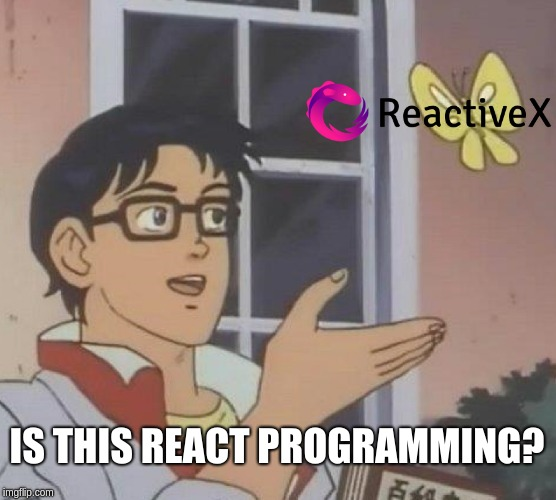

# Reactive Programming with Python

This repository includes the material used in my talk about **Reactive Programming** for **PythonMG Meetup**. All examples were done in Python and using [RxPy](https://github.com/ReactiveX/RxPY) library.

## Definition

  

First of all, unlike what many people think, Reactive Programming **is not** either React or React Native programming. It's a common mistake considering the names are too similar. What is **Reactive Programming** then?

**Reactive Programming** is an event-based asynchronous programming paradigm which you have asynchronous data streams that can be observed and you can define actions when it emits values.

## Examples
- [Example 1](example1/): Creating observables with **.from_** function
- [Example 2](example2/): Using **filter** operator
- [Example 3](example3/): Using **map** operator
- [Example 4](example4/): Using **lambda** in **subscribe**
- [Example 5](example5/): Executing in other thread
